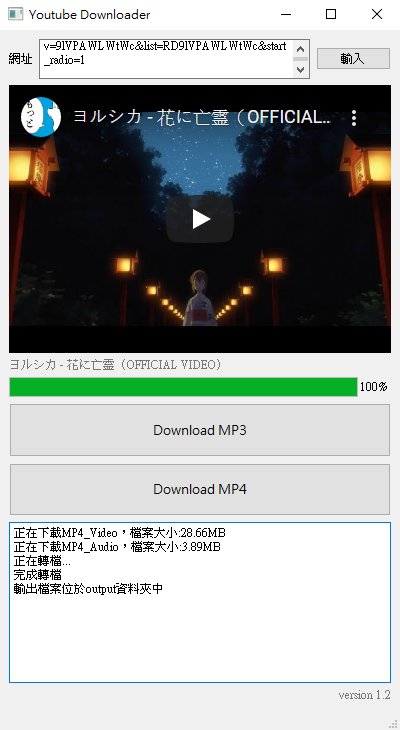

# YouTube Downloader

## Python packet requirement
* `python` - 3.7.6
* `pytube` - 9.6.4
* `PyQT5` - 5.11.3
* `pyqt5-tools` - 5.11.3.1.4
* `pexpect`

網路上能找到的Youtube Downloader通常較少提供Full HD的影片下載服務
然而720p畫質的影片以不足以提供使用者良好的使用者體驗
因此我結合python中的「pytube」套件獲取1080p畫質的影片以及聲音檔
透過影音處理框架「FFmpeg」將影片及聲音進行合併得到Full HD影片
最後利用PyQt設計使用者介面

